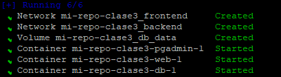
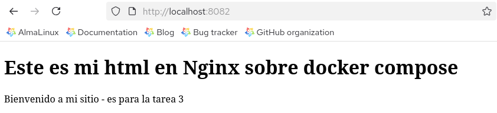
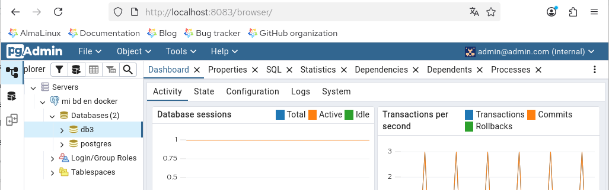
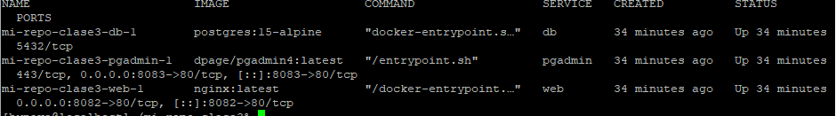
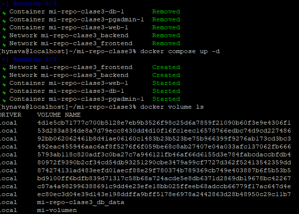
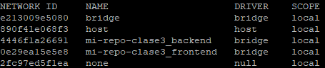

# mi-repo-clase3
Tarea 3 curso docker kubernetes

**Curso:** Docker & Kubernetes - Clase 3

**Estudiante:** Hans Nava

Mi-repo-clase3 es un entorno que muestra una web estática en Nginx y permite administrar una base de datos Postgresql desde pgAdmin, todo con docker compose.

## Stack

- **App:** Nginx
- **Base de datos:** PostgreSQL

## Ejecución

1. Clonar:
   ```bash
   git clone https://github.com/githanshync/mi-repo-clase3.git
   cd mi-repo-clase3

2. Levantar servicios:
   ```bash
   docker compose up -d



3.Acceder:

Mi Web: http://localhost:8082



Pgadmin: http://localhost:8083



### 4. Cómo Probar

## Verificación

1. Servicios corriendo:
   ```bash
   docker compose ps



2. Acceder a la web: http://localhost:8082

3. Verificar volumen persiste:
   ```bash
   docker compose down
   docker compose up -d
   docker volume ls
   


### 5. Capturas de Pantalla

## Screenshots

### Servicios corriendo


### API funcionando


## Conceptos Docker

- Docker Compose con 3 servicios
- Red custom: `mi-repo-clase3_backend` y `mi-repo-clase3_frontend`
- Volumen: `mi-repo-clase3_db_data` (persistencia)
- Variables de entorno: POSTGRES_USER, POSTGRES_PASSWORD y POSTGRES_DB
  
## Opcional:

docker network ls mostrando la red custom



docker exec haciendo ping entre servicios


